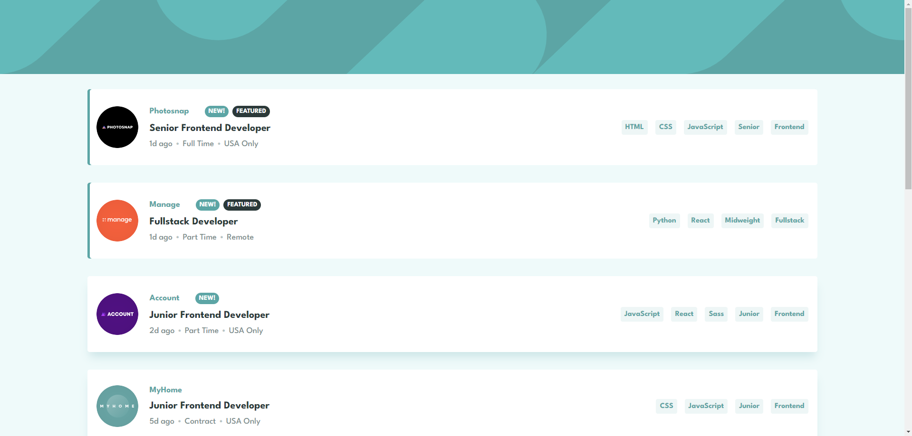
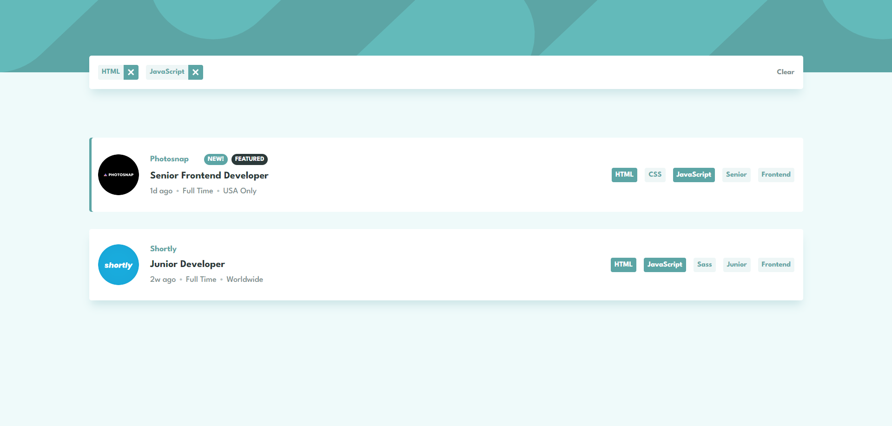
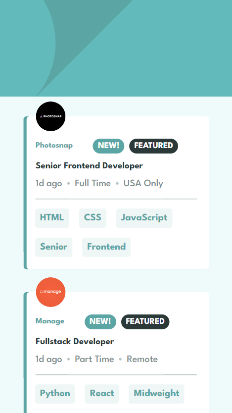
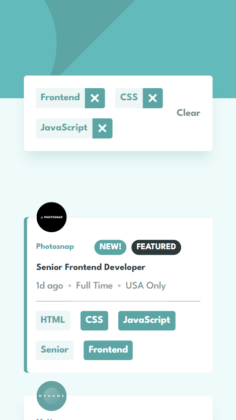

# Frontend Mentor - Job listings with filtering solution

Hi! I'm Eva. Thank you for deciding to familiarize yourself with my solution of one of the Frontend Mentor challenges.

This is a solution to the [Job listings with filtering challenge on Frontend Mentor](https://www.frontendmentor.io/challenges/job-listings-with-filtering-ivstIPCt). Frontend Mentor challenges help you improve your coding skills by building realistic projects. 

## Table of contents

- [Overview](#overview)
  - [The challenge](#the-challenge)
  - [Screenshot](#screenshot)
  - [Links](#links)
- [My process](#my-process)
  - [Built with](#built-with)
  - [What I learned](#what-i-learned)
  - [Continued development](#continued-development)
  - [Useful resources](#useful-resources)
- [Author](#author)
- [Acknowledgments](#acknowledgments)

## Overview

### The challenge

[Brief](https://www.frontendmentor.io/challenges/job-listings-with-filtering-ivstIPCt):
"Users should be able to:

- Filter job listings based on the categories selected;
- View the optimal layout for the interface depending on their device's screen size;
- See hover and focus states for all interactive elements on the page".

### Screenshot

Design:
- [Desktop](design/desktop-design.jpg)
- [Mobile](design/mobile-design.jpg)

My solution:

  
  
  

    
    
  

### Links

- Solution URL: [gh-pages](https://grigoryevaeva.github.io/vacancy-listings-with-filtering/)

## My process

### Built with

- React
- TypeScript
- Vite
- Feature-Sliced Design (FSD architecture)
- Redux Toolkit
- React Router
- SASS modules

### What I learned

The implementation of this project for me is:

1) First, the consolidation of basic knowledge about React Router and Redux Toolkit after the implementation of another project - [countries-listing](https://github.com/GrigoryevaEva/countries-listing)

2) Secondly, the study of TypeScript and FSD architecture, which was completely unfamiliar to me, as well as how the modular system works in SASS

3) I also used Vite and Yarn for the first time when creating the application

### Continued development

I plan to take on a joint project to develop the ability to review code, deepen my knowledge of working with git, and also gain experience working with TypeScript on more voluminous data with different representations of entities.

In the next project, I will study React Native.

### Useful resources

- [TypeScript Doc.](https://www.typescriptlang.org/docs/)
- [FSD Doc.](https://feature-sliced.design/ru/docs)
- [FSD examples](https://feature-sliced.design/ru/examples)
- [Yarn](https://yarnpkg.com/)

## Author

- Frontend Mentor - [@GrigoryevaEva](https://www.frontendmentor.io/profile/GrigoryevaEva)
